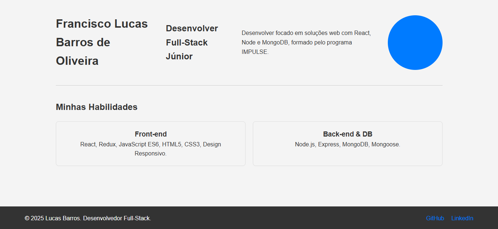

# 🚀 Portfólio Pessoal Estático e Versionado
## Projeto 1 de 100 | Jornada Full-Stack Expert

## 🌟 Status do Projeto
[](https://github.com/lucasbarrox/portfolio-pessoal)

## 📋 Descrição do Projeto
Este projeto é a minha primeira vitrine profissional, uma *single-page application* desenvolvida para o Projeto 1 da jornada de **100 Projetos Full-Stack Expert**. O foco foi na consolidação de **HTML/CSS semântico**, **Design Responsivo** (utilizando Flexbox e Grid) e o domínio do **Versionamento de Código** (Git/GitHub).

## 🔗 Demonstração (Deploy)
[**Acesse o Portfólio aqui!**]([https://lucasbarrox.github.io/portfolio-pessoal/git ])

### ✨ Funcionalidades
* **Design Responsivo:** Layout fluido e adaptável para Mobile, Tablet e Desktop (via Media Queries).
* **Estrutura Semântica:** Utilização de tags HTML5 (`<header>`, `<main>`, `<section>`, `<footer>`).
* **Layout Moderno:** Aplicação de Flexbox e CSS Grid para organização eficiente das seções.
* **Versionamento Organizado:** Histórico de *commits* limpo e uso de *feature branches*.

## 🛠️ Tecnologias Utilizadas
| Categoria | Tecnologia | Justificativa de Uso |
| :--- | :--- | :--- |
| **Estrutura** | HTML5 | Semântica e acessibilidade. |
| **Estilização** | CSS3 Puro | Foco na otimização e controle total de Flexbox/Grid. |
| **Layout** | Flexbox & CSS Grid | Domínio de técnicas avançadas de responsividade. |
| **Controle de Versão** | Git e GitHub | Uso de Branch Feature para desenvolvimento seguro. |

## 🖼️ Preview

<p align="center">
  
  <br>
  <em>Design totalmente responsivo (verifique a versão mobile!)</em>
</p>

## ▶️ Como Rodar o Projeto Localmente
1.  **Clone o Repositório:**
    ```bash
    git clone [https://github.com/lucasbarrox/portfolio-pessoal.git]
    ```
2.  **Acesse o Diretório:**
    ```bash
    cd portfolio-pessoal
    ```
3.  **Execute:**
    Abra o arquivo `index.html` diretamente no seu navegador.

## 👤 Autor

**Lucas Barros** - Desenvolvedor Full-Stack Júnior
<br>

**Conecte-se comigo:**
[]([https://www.linkedin.com/in/lucasbarrox/])
[]([https://github.com/lucasbarrox])